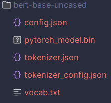

## 代码文件结构

```
├─data
│  └─data
│  └─test_without_label.txt
│  └─train.txt
├─model
│  └─models.py
└─utils
│   └─ablation.py
│   └─dataset.py
│   └─model_relative.py
│   └─preprocess.py
└─README.md
└─requirements.txt
└─train.py
└─test.py
```

## 执行代码流程

1.

```bash
pip install -r requirement.txt
```


2.补全数据和BERT。在`data\data`中添加图片与文本数据，从https://huggingface.co/models上下载`bert-base-uncased`文件，下载内容如下



3.运行`train.py`进行训练，运行`test.py`预测测试集的结果，运行`utils/ablation`查看消融实验结果

## 代码参考库

torch

torchvision

transformers

Pillow

tqdm