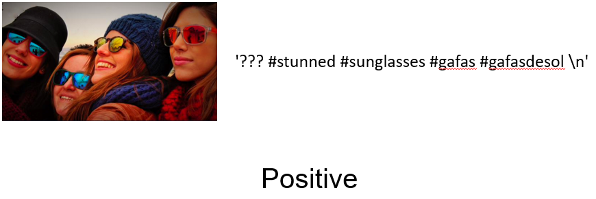
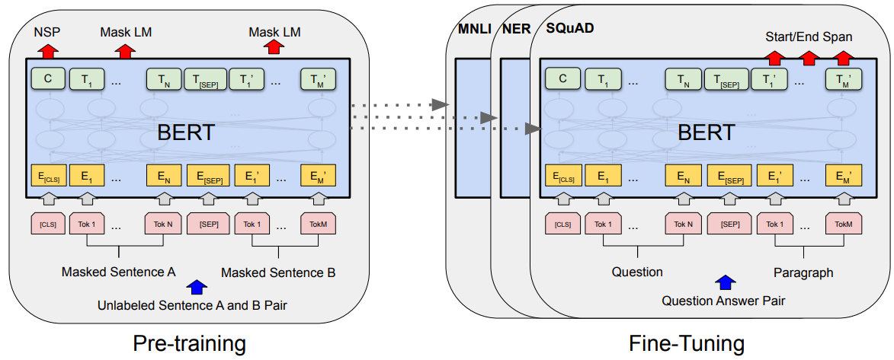
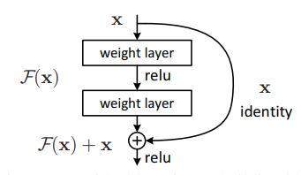
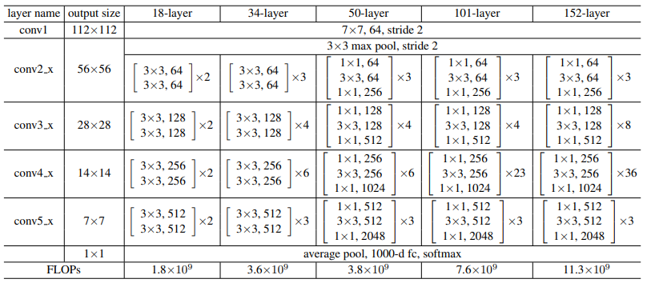
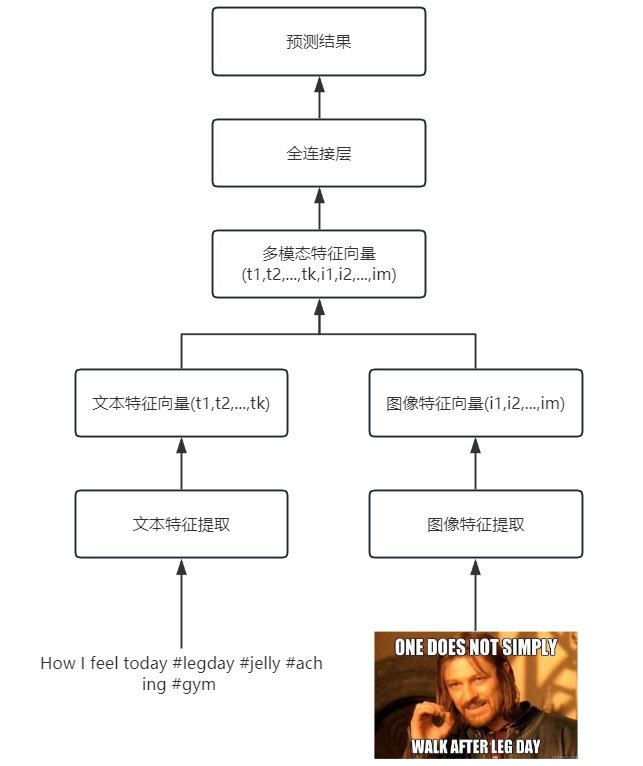
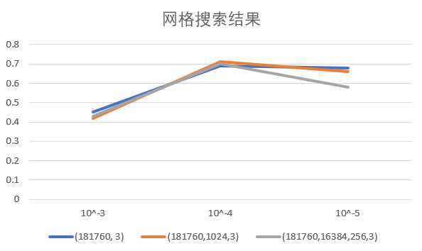

Github地址：[oncetrange/Multimodel-Sentiment-Analysis: Project of Contemporary AI 2023 Fall (github.com)](https://github.com/oncetrange/Multimodel-Sentiment-Analysis)

# 多模态情感分析

[TOC]

## 摘要

多模态机器学习是从多种模态的数据中学习并且提升自身的算法，是近年来机器学习中一个新兴领域。其中，多模态情感分析是一项经典任务，广泛运用于各个领域。在本次实验中，我们将设计并实现一个图像-文本双模态情感分析模型，对其进行优化并进行消融实验来对比分析双模态相比单模态的优势。

**关键字**：多模态情感分析，Bert，ResNet，消融实验，模型优化

## 项目介绍

### 任务介绍

从信息来源的角度来看，可以有文字、 声音、图像、味觉、触觉等等 。 我们把每一个这些信息的来源域称为一个模态。

我们之所以划分出不同的模态， 首先是因为不同场景下可以接触到的信息不同，其次是不同模态提供的信息往往不同， 最重要的是对不同模态的信息需要采用的处理和建模方式也不同。 简单情况下，我们可以仅通过单一的模态就可以得到一个对情感态度的判断。 自然地， 我们也可以结合多个模态的数据并将其统一建模， 这就是多模态方法。

情感分析是机器学习领域的经典问题，指通过从文本，图像等人们表达的数据中分析出人们背后的情感，具体的情感分类既可以简单的划分为积极，中性，消极，也可以更细化地分为多种不同的情感。

具体地，在本次实验中，我们需要进行图像-文本双模态情感分析，情感的种类分为积极，中性，消极三类，对给定的图像-文本数据，要求给出一个情感倾向的预测结果。

### 数据集介绍



本次实验所给定的数据集包括4869对相匹配的图像文本，每条数据内容如上图所示，为社交网站上用户发的图片与其对应文本，可以发现图像与文本中关于情感的信息并不明显，且文本中还包含无关信息，因此需要结合图像文本来进行双模态情感分析，从而来得到较为准确的答案。

其中，训练集有4000个样本，每个样本有与之对应的情感标签，测试集包含511个待预测的样本，剩余数据不在实验设计范围内

| 标签     | 数量     |
| -------- | -------- |
| positive | 2388     |
| neutral  | 419      |
| negative | 1193     |
| **总计** | **4000** |


## 模型

### BERT

BERT（Bidirectional Encoder Representations from Transformers）是一种基于Transformer架构的预训练语言模型，由Google在2018年提出。它在自然语言处理（NLP）任务中取得了重大突破，并成为了当今最先进的语言表示模型之一。

BERT的主要特点是双向性和无监督预训练。传统的语言模型（如循环神经网络）只能从左到右或从右到左单向地处理文本，而BERT通过使用Transformer的自注意力机制，使模型能够同时利用左侧和右侧的上下文信息。这种双向性使得BERT对于处理自然语言的各种任务具有更好的理解能力。

通过在大规模的预训练数据上进行训练，BERT学习到了丰富的语言表示，包括词汇、句子和文本之间的关系。预训练完成后，BERT可以通过微调（fine-tuning）在特定的下游任务上进行训练，如文本分类、命名实体识别、问答系统等。



BERT的网络结构如上所示，由多个transformer结构组成，网络输入为由词项和标识符（[CLS],[SEP]）构成的句子向量，经过transformer架构计算语言特征并输出，在本次文本分类任务中，我们将通过获得最后隐藏层的状态，并将其连接到一个全连接层上来输出情感预测的结果

### ResNet



ResNet（Residual Network）是一种深度卷积神经网络架构，由微软研究院的研究团队于2015年提出。它通过引入残差连接（residual connections）来解决深层网络训练中的梯度消失和模型退化问题，使得神经网络可以更容易地训练和优化。

如上图所示，ResNet的核心思想是引入残差块（residual block），这是一种跳跃连接（skip connection）的形式，允许信息在网络中直接跳过一个或多个层。这种跳跃连接使得模型可以学习残差映射，即网络的输出与输入之间的差异，而不是直接学习期望的映射。这种设计允许网络在训练过程中更轻松地学习恒等映射，从而提高了网络的性能和训练效果。

ResNet的核心架构由多个残差块组成，每个残差块由两个或三个卷积层组成。在每个残差块中，输入通过主路径（main path）进行前向传播，然后与跳跃连接进行相加操作，最后通过激活函数进行非线性变换。这种残差块的堆叠形式使得网络可以非常深，甚至可以超过100层。



如上表所示，论文中提出了多种ResNet的架构，其中较为著名的是ResNet-50，它是由50个卷积层构成的神经网络，兼顾了准确性与速度。在本次实验中，我们就将使用ResNet-50，与BERT相类似，ResNet-50已经在ImageNet上预训练过，能够学习到图像的许多特征，在具体使用时，我们调整ResNet最后的全连接层，使其输出合适维度的特征，再连接到一个全连接层上输出情感预测结果。

### MultimodalSentimentClassifier

基于BERT和ResNet模型，我们分别提取出文本中的特征和图像中的特征，将其拼接得到多模态特征向量，将该向量输入到全连接层中，从而得到多模态的情感预测结果



## 训练

### 数据预处理

对于文本数据，可以发现其编码格式不一，经过尝试，使用`GB18030`能够兼容所有文件。读取后，我们用`BertTokenizer`将其进行分词，并统一填充至最长句子向量的长度，以便模型训练。

```python
text_encoding = self.tokenizer.encode_plus(
            text,
            max_length=self.max_length,
            padding='max_length',
            truncation=True,
            return_tensors='pt'
        )
```

对于图像数据，考虑到`ResNet`是基于`224*224 `的`ImageNet`训练的，而数据集中的图像数据尺寸不一致。因此我们需要对图像进行转化，我们首先将其等比例放大，再中心裁剪出`224*224`的图片，再将其标准化，避免因尺度导致模型难以收敛

```python
img_transformer = transforms.Compose(
    [
        transforms.Resize(img_aligned_scale(target_size)),
        transforms.CenterCrop(target_size),
        transforms.ToTensor(),
        transforms.Normalize(mean=[0.485, 0.456, 0.406], std=[0.229, 0.224, 0.225])
    ]
)
```

### 超参数调优

本次实验主要对学习率，全连接层的数量与尺寸进行了网格搜索，网格搜索的结果如下



由结果可知，对于隐藏层的数量和尺寸而言，当只有一个维度为`(181760,3)`的全连接层时，模型过于简单，难以将拼接的特征拟合到分类结果上，而当全连接层数量较多时，又会导致训练时间增加，且容易发生过拟合，因此在隐藏层数量上，我们选择两层全连接层，维度分别为`(181760,1024),(1024,3)`。由于模型参数量很大而机器性能有限，参数搜索的空间不大，对于全连接层的设计仍有一些优化空间。

对于学习率，当学习率过大时，模型会在最优解附近震荡，无法收敛至合适的位置，因此会导致预测准确率很低，而当学习率太小时，收敛速度又太慢，训练开销太大，因此最终选择学习率为$1\times10^{-4}$。

### 消融实验

实验结果：

MultimodalSentimentClassifier：

准确率：71.9%

|        | negative | neutral | positive | average |
| ------ | -------- | ------- | -------- | ------- |
| 召回率 | 0.583    | 0.312   | 0.778    | 0.558   |
| 精确率 | 0.562    | 0.139   | 0.820    | 0.507   |
| f1值   | 0.571    | 0.196   | 0.799    | 0.522   |

BERTOnly:

准确率：68.4%

|        | negative | neutral | positive | average |
| ------ | -------- | ------- | -------- | ------- |
| 召回率 | 0.860    | 0.239   | 0.558    | 0.552   |
| 精确率 | 0.808    | 0.548   | 0.554    | 0.663   |
| f1值   | 0.675    | 0.333   | 0.660    | 0.556   |

ResNetOnly:

准确率：66.9%

|        | negative | neutral | positive | average |
| ------ | -------- | ------- | -------- | ------- |
| 召回率 | 0.732    | 0.286   | 0.500    | 0.506   |
| 精确率 | 0.532    | 0.133   | 0.719    | 0.461   |
| f1值   | 0.615    | 0.190   | 0.592    | 0.466   |

可以发现，多模态模型在准确率上相比BERT和ResNet单独而言优势明显，ResNet相比BERT更偏向于预测情感为积极，考虑到数据集中积极的标签占多数，这在准确率上能够有所帮助，但会损害其他类预测正确的概率，由于ResNet对多模态模型的影响，多模态模型虽然准确率更高了，但在召回率和精确率上与BERT相比反而略差一些。

### 遇到问题

- 模型无法收敛：

  首先想到的是学习率太大了，但调低学习率后虽有所改善但仍然无法收敛至较好的结果，又考虑到可能是样本数量太少，而ResNet和BERT两个模型太大，不足以进行拟合，但更换了之前图像分类中所用的小模型仍无法收敛。最后，将BERT和ResNet分别训练预测，发现主要是ResNet无法收敛，查了一些资料终于想到是由于图像没有标准化造成的，标准化后就能收敛了

- BERT调用问题：

  ```
  OSError: Can't load tokenizer for 'bert-base-uncased'. If you were trying to load it from 'https://huggingface.co/models', make sure you don't have a local directory with the same name. Otherwise, make sure 'bert-base-uncased' is the correct path to a directory containing all relevant files for a BertTokenizer tokenizer.
  ```

  按报错所说，我们到huggingface上手动下载下所需要用到的BERT模型，将其放到项目的目录下，并按照目录调用即可，本来BERT是可以通过transforms库直接下载并调用的，这可能是网络问题造成的，若用代理服务器又会产生另外的错误，因此还是下载到本地最好。

  另外，当批次输入训练数据至BERT时，dataloader提供batch的维度有问题，需要将经过tokenizer的`input_ids`和`attention_mask`分别转化一下再输入BERT。

## 总结

在本次实验中，我对多模态情感分析任务进行了深入的探索，并实现了基于BERT和ResNet的图像-文本双模态情感分析模型。另外，通过消融实验，我们能够发现多模态相比于单一的图像或文字分类模型有着显著的优势。

对我个人而言，本次实验让我回顾了过去学习的图像分类和文本分类模型，并将图像分类与文本分类模型融合，设计出新的多模态情感分析模型。这既让我复习了课程所学的知识，开阔了我对未来人工智能发展的视野，又锻炼了我的实践能力，令我受益匪浅

<div STYLE="page-break-after: always;"></div>

## References

1. He K, Zhang X, Ren S, et al. Deep residual learning for image recognition[C]//Proceedings of the IEEE conference on computer vision and pattern recognition. 2016: 770-778.
2. Devlin J, Chang M W, Lee K, et al. Bert: Pre-training of deep bidirectional transformers for language understanding[J]. arXiv preprint arXiv:1810.04805, 2018.
3. Mao H, Yuan Z, Xu H, et al. M-sena: An integrated platform for multimodal sentiment analysis[J]. arXiv preprint arXiv:2203.12441, 2022.
4. Han W, Chen H, Gelbukh A, et al. Bi-bimodal modality fusion for correlation-controlled multimodal sentiment analysis[C]//Proceedings of the 2021 International Conference on Multimodal Interaction. 2021: 6-15.

